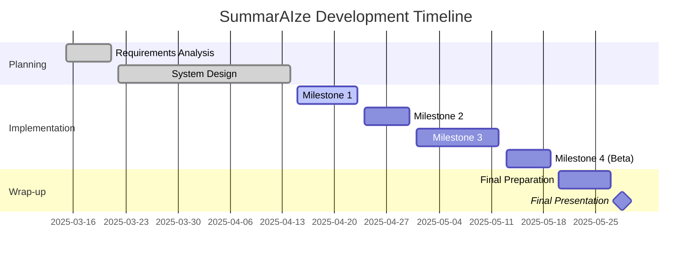

# 📚 SummarAIze Project Milestones

  
**Minhyeok Im, Semin Bae**  
**CSE416 / Spring 2025**  
**Last Modified: May/02/2025**
**[Realtime MileStone Docs](https://docs.google.com/document/d/1YD1cGAYec5Am-RQ4v8fjw25pL-mVJ49lrDPOW2bCgCY/edit?tab=t.0)**

## 🔍 Overview

SummarAIze is an **AI-powered platform** that revolutionizes how students and researchers interact with academic papers. Our system helps users efficiently read, summarize, and manage research papers through advanced AI summarization, citation extraction, and personalized paper recommendations.

## 👥 Team Members

| Name | Student ID | Role |
|------|------------|------|
| **Minhyeok Im** | 114181150 | Backend Development, DB Architecture |
| **Semin Bae** | 114730530 | Frontend Development, UX Design |

## 🗓️ Project Timeline

---

## 🏆 Milestone 1 - Database & Foundation
**Due: April 23, 2025 | Status: IN PROGRESS**

<b>📋 Milestone 1 Requirements Checklist</b>

### 💾 Database Implementation (Minhyeok)
- ✅ **Set up DynamoDB tables**
  - ✅ Users table
  - ✅ Papers table
  - ✅ User Archives
  - ✅ Connections table (for WebSockets)
- ✅ Create basic database CRUD operations
- ✅ Implement database connection utilities

### 🔧 API Server Initial Setup (Minhyeok)
- ✅ Set up Node.js project with necessary dependencies
- ✅ Configure AWS SDK for local development
- ✅ Implement basic error handling middleware
- ❌ Set up authentication middleware *(Moved to Milestone 3)*
- ✅ Configure CORS settings
- ✅ Set up logging

### 🎨 Frontend Foundation (Semin)
- ✅ Create React project with necessary dependencies
- ✅ Configure routing with React Router
- ✅ Set up Tailwind CSS for styling
- ⚙️ **Create login page UI**
  - ✅ Login form
  - ❌ Error handling *(Delayed to Milestone 3)*
  - ❌ Redirection logic *(Delayed to Milestone 3)*
- ⚙️ **Create registration page UI**
  - ✅ Registration form
  - ✅ Form validation
  - ❌ Success/error handling *(Delayed to Milestone 3)*
- ✅ Implement home page with file upload UI
- ✅ Create basic component structure

### 🔐 Authentication System Implementation (Semin)
- ✅ Implement user registration functionality
- ✅ Implement login functionality
- ✅ Set up token-based authentication
- ✅ Add token storage and management
- ✅ Create authentication context
- ✅ Add protected routes

### 🔌 Basic Server-Client Connection Testing (Semin)
- ✅ Create test API endpoints
- ✅ Implement API client service in React
- ✅ Test connection between frontend and backend
- ✅ Implement error handling for API calls
- ❌ Add loading states for API interactions *(Delayed to Milestone 3)*

### 📝 Documentation
- ✅ Update README.md with setup instructions
- ✅ Document API endpoints
- ✅ Add database schema documentation
- ✅ Create bug tracking system

---

## 🚀 Milestone 2 - Core Functionality
**Due: April 30, 2025 | Status: PLANNED**

<b>📋 Milestone 2 Requirements Checklist</b>

### 🔄 Complete API Server Implementation (Minhyeok)
- ⚙️ **Complete API endpoints for user authentication**
  - ✅ Login endpoint
  - ✅ Signup endpoint
  - ❌ Google OAuth integration endpoints *(Delayed to Milestone 4)*
  - ✅ Logout endpoint
- ⚙️ **Complete API endpoints for paper management**
  - ✅ Upload request endpoint
  - ✅ Upload confirmation endpoint
  - ✅ Paper processing endpoint
- ⚙️ **Complete API endpoints for library management**
  - ✅ Load library endpoint
  - ✅ Get paper details endpoint
  - ✅ Get content URL endpoint
- ❌ **Implement WebSocket connection for real-time updates** *(Delayed to Milestone 3)*
  - ❌ Connect/disconnect handlers
  - ❌ Paper process status handler

### 👤 User Profile Management (Minhyeok)
- ✅ Implement user profile retrieval API
- ⚙️ **Implement profile update endpoints**
  - ✅ Change username
  - ✅ Change password
  - ✅ Change profile image

### 🔗 Client-API Server Integration (Semin)
- ⚙️ **Implement API client service in React**
  - ✅ Authentication service
  - ✅ Paper upload service
  - ❌ WebSocket service *(Delayed to Milestone 3)*
  - ✅ Library service
- ⚙️ **Connect frontend components to API**
  - ✅ Login/Signup forms
  - ✅ Home page uploader
  - ❌ Library page *(Delayed to Milestone 3)*
  - ❌ Paper viewer *(Delayed to Milestone 3)*

### 📱 Google OAuth Integration (Semin)
- ❌ Implement Google OAuth on frontend *(Delayed to Milestone 4)*
- ❌ Connect OAuth flow to backend endpoints *(Delayed to Milestone 4)*
- ❌ Test OAuth authentication flow *(Delayed to Milestone 4)*

### 🧪 Testing
- ✅ API endpoint unit tests
- ✅ Authentication flow tests
- ✅ Database operation tests
- ❌ WebSocket connection tests

### 📝 Documentation
- ✅ Update API documentation with all endpoints
- ✅ Update project schedule
- ❌ Document OAuth integration process *(Delayed to Milestone 4)*

---

## 🔥 Milestone 3 - Feature Completion
**Due: May 12, 2025 | Status: PLANNED**

<b>📋 Milestone 3 Requirements Checklist</b>

### 🎨 Complete Frontend Implementation (Semin)
- ⚙️ **Finalize all UI components**
  - ✅ Home page
  - ✅ Login/Signup pages
  - ❌ Paper view page
  - ❌ Library page
  - ❌ User settings page
- ⏳ Implement responsive design for all screen sizes
- ⏳ Add loading states and transitions
- ⏳ Implement error handling and user feedback
- ⏳ Create and style all modals and popups
- ⏳ Implement theme styling consistency

### 🔄 Full API Server Integration (Minhyeok)
- ⏳ Complete remaining API endpoints
- ⏳ Optimize API responses
- ⏳ Implement caching where appropriate
- ⏳ Add rate limiting
- ⏳ Complete error handling for all edge cases
- ⏳ Finalize WebSocket functionality

### 💾 S3 Storage Server Setup (Minhyeok)
- ⏳ **Configure S3 buckets**
  - ⏳ Paper uploads bucket
  - ⏳ Summaries bucket
  - ⏳ User profile images bucket
- ⏳ Set up proper access policies
- ⏳ Implement file versioning if needed
- ⏳ Configure lifecycle rules
- ⏳ Set up encryption

### 📤 File Upload/Download Functionality (Semin)
- ⏳ Implement drag-and-drop file upload
- ⏳ Add file type validation
- ⏳ Create upload progress indicators
- ⏳ Implement resumable uploads for large files
- ⏳ Add file download functionality
- ⏳ Create PDF viewer component

### 🧪 Initial End-to-End Testing (Minhyeok)
- ⏳ Create end-to-end test suite
- ⏳ Test user registration flow
- ⏳ Test paper upload and processing flow
- ⏳ Test library management
- ⏳ Test user profile updates
- ⏳ Test edge cases and error handling

### 📝 Documentation
- ⏳ Update API documentation with final changes
- ⏳ Document S3 configuration
- ⏳ Create user documentation for platform features
- ⏳ Update README with latest setup instructions

---

## 🚢 Milestone 4 (Beta Release)
**Due: May 19, 2025 | Status: PLANNED**

<b>📋 Milestone 4 Requirements Checklist</b>

### 🌐 Web Application Deployment (Semin)
- ⏳ Deploy frontend application via Vercel
- ⏳ Configure build settings
- ⏳ Set up environment variables
- ⏳ Connect to GitHub repository
- ⏳ Configure custom domain (if applicable)
- ⏳ **Test deployed application**
  - ⏳ Test on different browsers
  - ⏳ Test on mobile devices
  - ⏳ Performance testing

### ☁️ AWS Services Configuration (Minhyeok)
- ⏳ Configure custom URL domain
- ⏳ Upload server code
- ⏳ **Initiate AWS Lambda functions**
  - ⏳ Authentication functions
  - ⏳ Paper processing functions
  - ⏳ Library management functions
- ⏳ Configure AWS API Gateway
- ⏳ Set up WebSocket API endpoint
- ⏳ Test all serverless functions

### 🔄 Final Integration (Both)
- ⏳ Connect frontend to production backend
- ⏳ Test all features in production environment
- ⏳ Monitor for performance issues
- ⏳ Implement any critical fixes

### 🧪 Beta Testing (Semin)
- ⏳ Create test accounts
- ⏳ Conduct user acceptance testing
- ⏳ Collect and address feedback
- ⏳ Fix critical bugs
- ⏳ Document known issues

### 📝 Documentation
- ⏳ Create beta release notes
- ⏳ Update README with production details
- ⏳ Document deployment process
- ⏳ Update bug tracking system
- ⏳ Create user guide

### 🎤 Presentation Preparation
- ⏳ Create presentation slides
- ⏳ Prepare demo script
- ⏳ Assign presentation roles
- ⏳ Practice presentation
- ⏳ Prepare for Q&A

---

## 🎓 Final Project Presentation
**Due: May 28, 2025 | Status: PLANNED**

<b>📋 Final Requirements Checklist</b>

### 🧪 Final Testing and Bug Fixes
- ⏳ **Test case verification (Semin)**
  - ⏳ Create comprehensive test cases
  - ⏳ Verify all features against requirements
  - ⏳ Document test results
- ⏳ **Bug reporting and tracking (Minhyeok)**
  - ⏳ Organize reported bugs by severity
  - ⏳ Fix critical bugs
  - ⏳ Document known issues
- ⏳ **Regression testing (Semin)**
  - ⏳ Ensure new fixes don't break existing features
  - ⏳ Test all user flows
- ⏳ **User acceptance testing (Minhyeok)**
  - ⏳ Get feedback from test users
  - ⏳ Implement critical feedback

### 📝 Final Documentation
- ⏳ Complete API documentation
- ⏳ User manual
- ⏳ Installation guide
- ⏳ Developer documentation
- ⏳ **Final report with:**
  - ⏳ Project overview
  - ⏳ Technical architecture
  - ⏳ Challenges and solutions
  - ⏳ Future improvements

### 🎤 Final Presentation
- ⏳ **Create presentation slides (Semin)**
  - ⏳ Project overview
  - ⏳ Key features demonstration
  - ⏳ Technical highlights
  - ⏳ Challenges and solutions
- ⏳ **Demo script preparation (Minhyeok)**
  - ⏳ Plan demo flow
  - ⏳ Prepare backup demos in case of issues
  - ⏳ Create talking points
- ⏳ **Live demonstration (Semin & Minhyeok)**
  - ⏳ Practice run-through
  - ⏳ Prepare for common questions
  - ⏳ Assign presentation roles
- ⏳ **Q&A preparation (Minhyeok)**
  - ⏳ Anticipate questions
  - ⏳ Prepare responses

### 📦 Final Submission Materials
- ⏳ Source code (with documentation)
- ⏳ Setup instructions
- ⏳ User documentation
- ⏳ Access information for deployed application
- ⏳ Final presentation slides
- ⏳ Project report

---

## 📊 Current Progress Summary

| Milestone | Completion | Status | Key Focus |
|-----------|------------|--------|-----------|
| **Milestone 1** | 95% | 🟢 COMPLETE | Database & Foundation |
| **Milestone 2** | 85% | 🟢 COMPLETE (Delayed Auth) | Core Functionality |
| **Milestone 3** | 10% | 🟠 IN PROGRESS | Feature Completion |
| **Milestone 4** | 0% | 🔵 UPCOMING | Beta Release |
| **Final Presentation** | 0% | 🔵 UPCOMING | Project Completion |

---

## 🔄 Project Status Updates

Team members will provide weekly status updates including:
- List of tasks assigned and completed
- List of tasks in progress
- Percentage of completion for partial tasks
- Challenges encountered and solutions

### Group Progress Evaluation

At the end of each milestone, the team will conduct:
- Overall progress assessment (on track, ahead, or behind)
- Team grade self-assessment with justification
- Adjustment plan for any schedule deviations
- Final feature set confirmation

---

  
**SummarAIze - Smart Summary, Smarter Research**  
CSE 416 - Software Engineering Project  
State University of New York at Stony Brook

